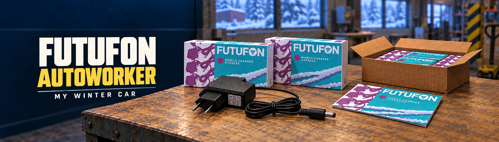

# Futufon AutoWorker for My Winter Car



Version **1.2.1 for MSCLoader** automates factory packaging with four selectable
modes, configurable volume and speed, soft pause, live mode switching and a
Russian/English HUD. The default F8 run assembles 44 complete packages, fills
a shipping carton, delivers it to a player pallet and stops.

**[Download 1.2.1](dist/FutufonAutoWorker-1.2.1.zip)** ·
**[Installation and controls](INSTALL.md)** ·
**[Инструкция на русском](FutufonAutoWorkerMscModLoader/README.md)** ·
**[Changes](CHANGELOG.md)**

This is a public test release. The four modes in 1.1.1 were tested in-game by
the user. The new transitions, carton-layer graphics and expanded HUD in 1.2.1
pass automated checks and still need wider in-game testing.

## Modes and settings

Open **MSCLoader → Futufon AutoWorker**.

| Mode | Supplies | Small packages | Shipping carton |
| --- | --- | --- | --- |
| 1. Full cycle | Automatic pickup/refill | Automatically packed | Delivered to pallet |
| 2. Manual delivery | Automatic pickup/refill | Automatically packed | Carry it yourself |
| 3. Loose packages | Automatic pickup/refill | Four stacks of up to 11 | Pack and deliver manually |
| 4. Manual supplies | Bring and open them yourself | Four stacks of up to 11 | Pack and deliver manually |

Mode 4 leaves supply containers where the player placed them. Missing or empty
supplies pause production until replacements are brought and opened on the
same table. Loose-package modes wait when the output stacks are full; these
are ordinary pickable game objects.

Volume selects **one batch of 44** or the **initially free slots on one pallet**,
up to four batches/176 packages. Full cycle uses the same target pallet.
Manual delivery waits for the carton to be delivered before preparing another.
Speed is adjustable from 10% to 100%; the default 100% preserves the original pace.

## Controls

| Control | Action |
| --- | --- |
| F8 | Start / soft pause / resume |
| F6 | Show / hide the HUD |
| Next mode — assign in MSCLoader keybindings | Cycle 1 → 2 → 3 → 4 → 1 |
| Batch volume — assign in MSCLoader keybindings | One carton ↔ fill one pallet |
| Diagnostic recording — unassigned | Toggle detailed file logging |
| State snapshot — unassigned | Save one full snapshot to file |

All keys can be remapped. Diagnostic keys F7/F9 from the previous release are
no longer assigned by default, and their old bindings are not imported.

Mode and volume can be selected before F8 and while paused; the HUD immediately
shows the choice. Volume changes apply to the next run; current progress remains
visible while working.
Pause and mode changes during work finish the current small package before taking effect.
Mode selection while paused does not start work; press F8 to resume.
Changes retain batch progress, existing stacks and carton contents. Previously
stacked packages remain where they were placed; they are not automatically
moved into a carton. A mixed run can include stacks and a partial carton.

Volume is fixed for a run. Language, speed and HUD visibility update live.
Moving away during assembly requests a soft pause. Players can walk away
while waiting for manual supplies or delivery.

## HUD and saved cartons

The HUD shows selected mode/volume, progress, supplies, pallet space, the current
task and native supervisor status. Accumulated idle time is labelled in game
minutes. It also displays clock-in/out times for the current or last
shift, the game's signed overtime balance, and a **Tuesday-only 13:10 meeting**
reminder. Last-shift times are reconstructed from saved clock-in and duration
after loading. Optional lunch and shift-end notices appear at 11:00 and 16:00.

The game saves partial carton counts but can show only the upper completed
layer. The mod adds visual-only lower layers, including after loading.
Native contents, collision, mass and delivery accounting remain unchanged.

Automation and stack progress last for the loaded session; after loading a
save, start a new run. Saved shipping-carton contents can be continued.
Carton counts are checked before assembly and packing, including manual additions
while paused. A carton containing 17 complete packages needs only 27 more;
a full carton needs no new parts. Manually packing this run's own stacked output
does not count those packages twice.

## Installation and feedback

Requires My Winter Car and
[MSCLoader for My Winter Car](https://www.nexusmods.com/mywintercar/mods/3).
Close the game and copy the DLL from the ZIP's `Mods` directory into your active
MSCLoader Mods folder. Install MSCLoader separately. Load a save, clock in,
stand at a clear Futufon work table, look down at the tabletop and press F8.

Leave table space for assembly, supplies and stacks; carton modes also need
floor space. Automatic delivery requires free slots on a player pallet.
Manual modes need player participation and do not guarantee zero recorded
idle time. Other factory-job mods have not been fully tested.

The mod uses existing PlayMaker actions for supplies, assembly, packing and
delivery. Attendance, pay and supervisor decisions use the game's own logic.
Logs are stored in `AutoWorkerLogs` beside the DLL, normally
`Mods/AutoWorkerLogs/`. See the
[public test checklist](publishing/nexus/PUBLIC-TEST-CHECKLIST.txt) for feedback.

## Build and validation

Open `FutufonAutoWorkers.slnx` in Visual Studio, or use PowerShell 7:

```powershell
.\FutufonAutoWorkerMscModLoader\build.ps1 -GamePath 'H:\SteamLibrary\steamapps\common\My Winter Car'
.\FutufonAutoWorkerMscModLoader\tests\run-tests.ps1
```

The active project targets .NET Framework 3.5 and uses assemblies from the
installed game. If MSCLoader injects its assembly at runtime, provide its MWC
reference assembly in `FutufonAutoWorkerMscModLoader/lib/MSCLoader.dll` or pass
`-MSCLoaderPath`. Install MSCLoader in the game as well. Only the built mod DLL
goes into Mods.

Checks exercise the actual scheduling iterator with simulated physical actions:
all 16 mode transitions, mixed outputs, partial/full cartons, pause/resume and
44/176 limits. New checks cover the actual selection hotkey handler, manual
additions before start/while paused and own-stack transfers. They also cover saved shift times, signed overtime, Tuesday
reminders, lower-row counts and quiet default logging. Native-flow scripts
accept locally extracted game JSON; these inputs are not part of the release.

The `FutufonAutoWorkers` folder retains earlier BepInEx experiments for reference.
The active solution and current download use MSCLoader.

License: [MIT](LICENSE). Code was developed using Codex; generated code is
disclosed in assembly metadata. Promotional artwork was generated with imagegen.
